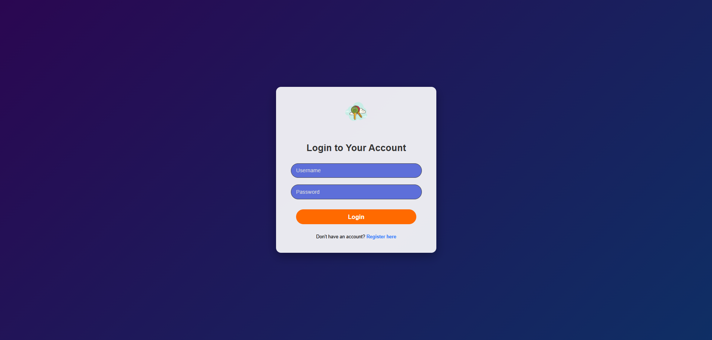
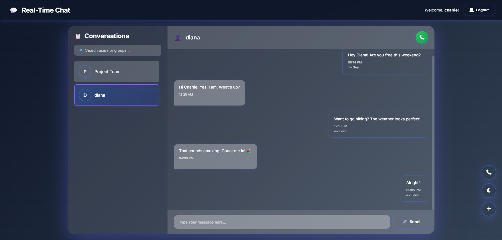
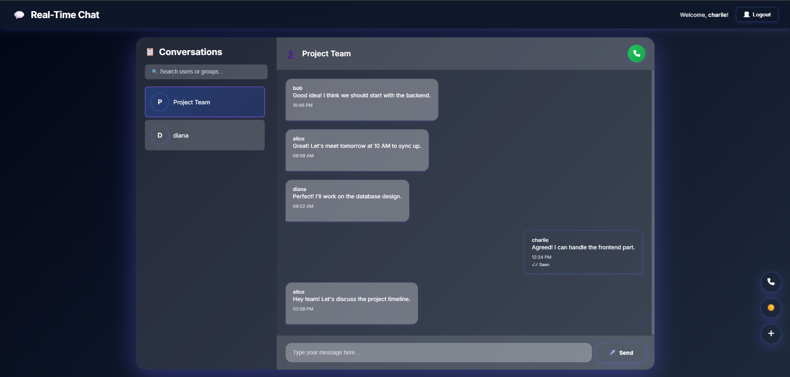
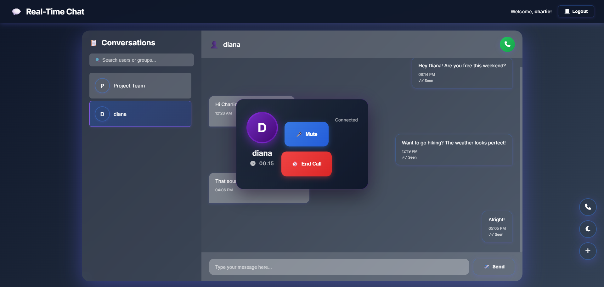
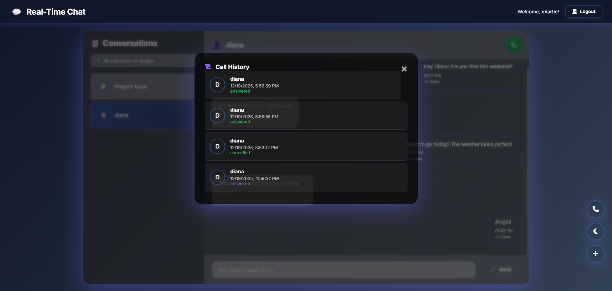

# Real-Time Communication Platform

A modern, secure real-time chat and voice call application built with Node.js, Socket.IO, and WebRTC. Features include private messaging, group chats, voice calls, and call history tracking.

## ✨ Features

- **User Authentication**: Secure JWT-based authentication with password hashing
- **Real-Time Messaging**: One-to-one and group messaging with Socket.IO
- **Voice Calls**: WebRTC-based voice calls with mute functionality
- **Call History**: Track all incoming, outgoing, and missed calls
- **Message Status**: Read receipts and delivery status
- **User Search**: Search for users and groups
- **Group Management**: Create and manage group conversations
- **Dark Mode**: Toggle between light and dark themes
- **Responsive Design**: Works on desktop and mobile devices
- **Security**: Rate limiting, input validation, CORS protection, and Helmet security headers

## 📸 Screenshots

<div align="center">

### 🔐 Login Page


### 💬 Chat Interface


### 👥 Group Chat


### 📞 Voice Call


### 📋 Call History


</div>

## 🛠️ Tech Stack

- **Backend**: Node.js, Express.js
- **Real-Time**: Socket.IO for messaging, WebRTC for voice calls
- **Database**: MongoDB with Mongoose ODM
- **Frontend**: HTML5, CSS3, Vanilla JavaScript
- **Security**: JWT authentication, bcrypt password hashing, Helmet.js, Rate limiting
- **SSL/TLS**: HTTPS support with self-signed certificates


## 🚀 Getting Started

### Prerequisites

- Node.js (v14 or higher)
- MongoDB (local or cloud instance like MongoDB Atlas)
- OpenSSL (for generating SSL certificates)

### Installation

1. **Clone the repository**
   ```bash
   git clone https://github.com/mhelail/real-time-communication-platform.git
   cd real-time-communication-platform
   ```

2. **Install dependencies**
   ```bash
   npm install
   ```

3. **Set up environment variables**
   
   Copy the `.env.example` file to `.env`:
   ```bash
   cp .env.example .env
   ```
   
   Edit `.env` and configure the following:
   ```env
   PORT=8443
   HTTP_PORT=8080
   NODE_ENV=development
   
   MONGODB_URI=mongodb://localhost:27017/real-time-communication-platform
   
   JWT_SECRET=your-super-secret-jwt-key-minimum-32-characters-long-for-security
   
   ALLOWED_ORIGINS=https://localhost:8443,http://localhost:8080
   ```

4. **Generate SSL certificates**
   
   Create the `ssl` directory and generate self-signed certificates:
   ```bash
   mkdir ssl
   openssl req -x509 -newkey rsa:4096 -keyout ssl/key.pem -out ssl/cert.pem -days 365 -nodes
   ```
   
   When prompted, you can press Enter for all fields or fill them in as needed.

5. **Start MongoDB**
   
   Make sure MongoDB is running on your system:
   ```bash
   # On Windows (if installed as service, it should start automatically)
   # On Linux/Mac
   sudo systemctl start mongod
   # Or
   mongod
   ```

6. **Start the server**
   ```bash
   npm start
   ```
   
   Or for development:
   ```bash
   npm run dev
   ```

7. **Access the application**
   
   Open your browser and navigate to:
   - **HTTPS**: `https://localhost:8443`
   - **HTTP** (redirects to HTTPS): `http://localhost:8080`
   
   ⚠️ **Note**: Since we're using self-signed certificates, your browser will show a security warning. Click "Advanced" and then "Proceed to localhost" to continue.

## 📝 Usage

### Registration

1. Navigate to the registration page
2. Enter a username (3-20 characters, alphanumeric and underscores only)
3. Enter a password (minimum 6 characters)
4. Click "Sign Up"
5. You'll be redirected to the login page

### Login

1. Enter your username and password
2. Click "Login"
3. You'll be redirected to the chat interface

### Chatting

1. **Start a conversation**: Use the search bar to find users or groups
2. **Send messages**: Type in the message input and press Enter or click Send
3. **Create a group**: Click the "+" button, enter a group name, select members, and create
4. **Make a call**: Click the phone icon in an active conversation
5. **View call history**: Click the call history button (phone icon in floating buttons)

### Voice Calls

1. Click the phone icon (✆) in an active conversation
2. The recipient will receive an incoming call notification
3. They can accept or decline the call
4. During the call, you can mute/unmute your microphone
5. Click "End Call" to terminate the call

## 🔒 Security Features

- **JWT Authentication**: Secure token-based authentication
- **Password Hashing**: bcrypt with salt rounds
- **Rate Limiting**: Prevents brute force attacks
- **Input Validation**: Server-side validation and sanitization
- **CORS Protection**: Configurable allowed origins
- **Helmet.js**: Security headers protection
- **HTTPS**: Encrypted connections

## 🐛 Troubleshooting

### SSL Certificate Errors

If you see SSL certificate errors:
- Make sure `ssl/key.pem` and `ssl/cert.pem` exist
- Regenerate certificates if needed
- Accept the self-signed certificate in your browser

### MongoDB Connection Issues

- Verify MongoDB is running: `mongod --version`
- Check your `MONGODB_URI` in `.env`
- For MongoDB Atlas, ensure your IP is whitelisted

### Port Already in Use

If you get "port already in use" errors:
- Change `PORT` and `HTTP_PORT` in `.env`
- Or stop the process using those ports

### Socket.IO Connection Issues

- Check browser console for errors
- Verify CORS settings in `.env`
- Ensure you're accessing via HTTPS

## 🔧 Configuration

### Environment Variables

| Variable | Description | Default |
|----------|-------------|---------|
| `PORT` | HTTPS server port | 8443 |
| `HTTP_PORT` | HTTP redirect port | 8080 |
| `NODE_ENV` | Environment (development/production) | development |
| `MONGODB_URI` | MongoDB connection string | - |
| `JWT_SECRET` | Secret key for JWT tokens | - |
| `ALLOWED_ORIGINS` | Comma-separated allowed origins | - |

### Rate Limiting

- **Auth endpoints**: 5 requests per 15 minutes per IP
- **API endpoints**: 100 requests per 15 minutes per IP

## 📦 Dependencies

### Production
- `express` - Web framework
- `socket.io` - Real-time communication
- `mongoose` - MongoDB ODM
- `jsonwebtoken` - JWT authentication
- `bcrypt` - Password hashing
- `cors` - CORS middleware
- `helmet` - Security headers
- `express-rate-limit` - Rate limiting
- `dotenv` - Environment variables
- `uuid` - Unique identifiers

## 🚧 Development

### Project Structure Improvements

- ✅ Added middleware for error handling and validation
- ✅ Implemented rate limiting
- ✅ Enhanced security with Helmet.js
- ✅ Improved error handling and logging
- ✅ Added input validation and sanitization
- ✅ Enhanced database models with indexes
- ✅ Improved code organization and structure

### Future Enhancements

- [ ] File sharing (images, documents)
- [ ] Video calls
- [ ] Message reactions
- [ ] Typing indicators
- [ ] Online/offline status
- [ ] Message search
- [ ] Message editing and deletion
- [ ] User profiles and avatars
- [ ] Push notifications
- [ ] Mobile app (React Native)


## 🤝 Contributing

Contributions are welcome! Please feel free to submit a Pull Request.

## 📧 Support

For issues and questions, please open an issue on GitHub.

---